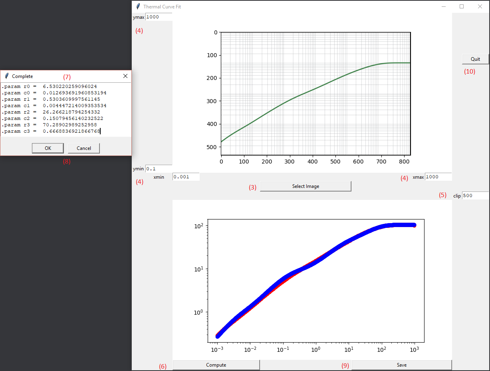

# Thermal-Curve-Fit
This App will take in a image from a thermal impedance curve of a datasheet and will convert it to a 4th order Foster RC thermal Model.

Manually tuning a model takes a ton of time. This app will do it for you :)

If you don't want to run the app you can download the base class and run it in your favorite python environment. 


# How to use the App:

1) Snip a picture of the thermal plot you are trying to curve fit with your favorite screen snipping tool. Save it as a png file (No other format is supported). The bigger it is the more accurate the curve fit will be.
2) Open up ThermalCurve.exe.
3) Select image by pressing the "Select Image" button.
4) Set your X and Y axis limits as per the limits shown in the datasheet in the text fields.
5) If you want to limit the curve to a max C/W then change the clip field, otherwise make this number big.
6) Push "Compute" button and the values will be generated.
7) A Pop-Up message with RC values available for you to review.
8) Push "OK" or "Cancel" button after you are done reviewing the RC values. The Pop-Up will go away and the bottom graph will be updated.  
9) Push "Save" button Save your new model in LTspice file (.asc) and it will have new RC values updated in it, along with a test circuit to see how you did.
10) Push "Quit" button to close the App. 

# Run in Python only:

Use ThermalCurve.py as your import for the class.

This code depends on the below libraries. It has been tested on the below versions only on a Windows 10 Machine:

```
python 3.7.7
numpy 1.18.4
scipy 1.4.1
matplotlib 3.2.1
```

### How to use:
```
from ThermalCurve import ThermalCurveFit
c = ThermalCurveFit()
c.setFileName('C:/smb.png') # some file path to the png image
c.setYAxis(.1,1000) # use datasheet to set up the min and max value for Y axis
c.setXAxis(.001,1000) # use datasheet to set up the min and max value for X axis
c.setClip(200) # If you want to limit the max C/W then make then set to the value you want, otherwise make this larger than your max C/W
c.compute() #This will print out .param values for each RC.

c.graph() # This will plot the extracted data and will show the thermal model on top of it. 
```

### FAQs:

Q: How do I install the app? 

A: Download the zip file and unpack it anywere on your Windows Desktop as it is self contained. Inside the folder there is a "ThermalCurve.exe" that will open the App. You can create a short cut to run it easier.


Q: How does it grab the datapoints?

A: It is looking for pixels that are not black and white. All other colors will be used as a valid datapoint. Then it looks at each column and gets the mean location; this gets the center of the curve. It then saves the mean position in a new array. 


Q: What if the curve is all in black and white?

A: I find programs like MSPaint does a good job filing the curve with color and it does not accidentally fill the grid.


Q: What if there are multiple lines and in black and white? 

A: I find it easy to use programs like MSPaint to erase where the extra lines meet. Then fill the curve with a color.


Q: What if the line isn't complete?

A: I find it easy to edit the image to complete the line.

## License

This project is licensed under the MIT License - see the [LICENSE.txt](LICENSE.txt) file for details
